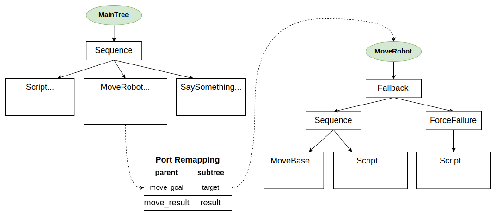

# 1. 行为决策前言

- 机器人行为决策是指机器人在特定环境下通过感知和推理，从众多行为选项中选择出最佳行为策略，并产生相应的动作执行，从而实现自主行动和解决问题的能力。

机器人行为决策系统设计有以下原则：

- 适应性：机器人行为决策系统<u>需要具备适应多变环境和任务需求的能力</u>，需要<u>能够根据环境变化自动调整策略和行为。</u>
- 高效性：行为决策系统**需要具备高效的决策速度**。要在有限的时间内作出最佳的决策，并能够高效地执行决策结果。
- 可靠性：主要体现在该行为决策系统的鲁棒性。
- 透明性：行为决策系统需要具备一定的透明性和可解释性，主要是增强用户对其理解。

# 2. 行为树vs决策树

- 简单来说：

  **决策树**：制定决策

​	   **行为树**：控制行为

​	遍历方式：

​		决策树：每一次都从根到叶子分析；为了让决策树正常工作，每个父节点的子节点都要能表达出父节点所有可能的决策；如果一个节点可以应答“是，否，可能”，那么那必须有三个子节点：“是”节点、“否”节点和“可能”节点。这就意味着，在到达结束节点前，总是可以遍历到某个底层节点。这种遍历总是向下的。


​	行为树：第一次分析（或重置后），它们从根节点开始（这里所有的父节点作为选择器），并且从左到右分析每个子节点。这些子节点按优先级排列。如果一个子节点所有的条件都满足，就开始它的行为。当一个节点开始一个行为，这个节点被设置为“运行中”，并返回这个行为。下一次分析这棵树的时候，重新检查最高优先级的节点，当走到“运行中”节点时，它便知道从它暂停的地方继续执行它。在到达结束状态之前，这个节点可以包含一系列的行动和条件。任意条件失败，遍历器便会返回到父节点。父选择器接着移动到下一个优先级的子节点上。


> 遍历从根节点开始，走到1号子节点，检查子节点的条件（例如“周围是否有滴人？”）。这个条件失败了，遍历器返回树（根节点）并移动到2号节点。2号节点执行了一个行动（例如寻路）和一个行为（例如沿路线走）。“沿路线走”的行为被设置为“运行中”，并且行为树返回状态“运行中”。失败和完成的节点会返回“待命”。接着下一次我们检查这个树，我们再次从最高优先级的节点开始。它又失败了，所以我们执行到2号节点。在2号节点，我们发现有一个“运行中”的行为。当我们发现这个行为完成了，那么我们把它标记成“完成”并返回。然后这颗行为树就被重置了，并准备好再次开始。

- 总结：行为树的运行框架比决策树更加复杂，行为树允许执行更复杂的行为，适合用于更多对行为的控制。考虑到实际目标是令机器人通过自主决策执行不同的行为，更侧重于行为部署，所以选择学习行为树

# 3. Introduction to BTs

# 4. Main Concepts

- 编写行为树，行为树的源码是什么语言？C++ ；还有xml语言，这是干什么的？
- 用户使用c++ 编写 树的节点TreeNode ，在运行时使用XML 格式进行树的实例化

## 4.1 何为TreeNode？

- 任何TreeNode都可以被看作是一种调用回调的机制，即 运行一段代码。这个回调做什么取决于你。

## 4.2 创建具有继承的自定义的节点

- 在上面的示例中，调用的特定类型的treenode `HelloTick` 是使用函数指针（依赖注入）创建的

- 通常，要定义自定义TreeNode，应该继承 类 `TreeNode` ，或者更具体地说，它的派生类
  - `ActionNodeBase`:动作节点，没有子节点，需要由开发者实现，负责执行具体任务。有同步和异步之分。
  - `ControlNode`：控制节点，有至少1个子节点，负责控制执行流程；可以细分成非常多的种类。
  - `ConditionNode`:条件节点，没有子节点，需要由开发者实现，不可以返回RUNNING，必须atomic and synchronous，负责任务执行的判断条件，不应该改变系统的状态。
  - `DecoratorNode`:装饰节点，有且仅有1个子节点，负责重复执行子节点，或更改子节点的返回结果。

## 4.3 Dataflow，Ports and Blackboard

- Blackboard 是一块储存着 所有 *key/value* 的 位置，这个位置可被树所有的节点所共享
- Ports 是节点之间用来交换信息的一种机制
- Ports 通过 Blackboard 中的相同键 进行连接
- 一个节点的端口数量、名称和类型必须在编译时知道(C)； 端口之间的连接是在部署时完成的（XML）
- 您可以将任何C类型存储为值（我们使用_type擦除技术） 类似于std::any)

# 5. The XML schema

```xml
 <root BTCPP_format="4">
     <BehaviorTree ID="MainTree">
        <Sequence name="root_sequence">
            <SaySomething   name="action_hello" message="Hello"/>
            <OpenGripper    name="open_gripper"/>
            <ApproachObject name="approach_object"/>
            <CloseGripper   name="close_gripper"/>
        </Sequence>
     </BehaviorTree>
 </root>
```

## 5.1 **通过这个简单的例子来说说如何使用xml的语法来构建行为树**

1. 树的第一个标签是` <root> ` 它应该包含一个或多个标签 `<BehaviorTree>`
2. 标签 `<BehaviorTree>` 应该有属性 `[ID]` 
3. 每个TreeNode由single tag表示。特别是:
   - ID: TreeNode 在 factory 中注册需要ID
   - name：实例的名称，可选
   - Ports：通过attribute配置，在这个例子中，需要输入端口 `message`

## 5.2 **在 子节点 数量方面**

- `ControlNodes` contain **1 to N children**.`ControlNodes` 包含1 ~ N个子节点。
- `DecoratorNodes` and Subtrees contain **only 1 child**.`DecoratorNodes` 和Subtrees只包含1个子树。
- `ActionNodes` and `ConditionNodes` have **no child**.`ActionNodes` 和 `ConditionNodes` 没有子节点。

## 5.3 **Ports Remapping 端口重映射 和 Pointers to Blackboards entries 指向黑板条目的指针**

- BB键使用以下语法表示： `{key_name}`

```xml
 <root BTCPP_format="4" >
     <BehaviorTree ID="MainTree">
        <Sequence name="root_sequence">
            <SaySomething message="Hello"/>
            <SaySomething message="{my_message}"/>
        </Sequence>
     </BehaviorTree>
 </root>
```

序列的第一个子序列输出“Hello”，第二个子节点读取和写入blackboard 中的entry中包含的值 叫做“my_message”

## 5.4 **紧凑与显式表示**

- 以下两种语法都是有效的

```xml
 <SaySomething               name="action_hello" message="Hello World"/>
 <Action ID="SaySomething"   name="action_hello" message="Hello World"/>
```

我们称前者为 “compact”语法 ，后者为 “explicit” 语法

即使紧凑语法更方便、更易于编写，但是它提供的关于 TreeNode 的信息过少，像Groot 这个图形化工具 需要添加显式语法或附加信息。可以使用`<TreeNodeModel>`添加此信息

也就是说：为了使用Groot ，你需要这样写：

```xml
 <root BTCPP_format="4" >
     <BehaviorTree ID="MainTree">
        <Sequence name="root_sequence">
           <Action ID="SaySomething"   name="action_hello" message="Hello"/>
           <Action ID="OpenGripper"    name="open_gripper"/>
           <Action ID="ApproachObject" name="approach_object"/>
           <Action ID="CloseGripper"   name="close_gripper"/>
        </Sequence>
     </BehaviorTree>
 </root>
```

或者

```xml
 <root BTCPP_format="4" >
     <BehaviorTree ID="MainTree">
        <Sequence name="root_sequence">
           <SaySomething   name="action_hello" message="Hello"/>
           <OpenGripper    name="open_gripper"/>
           <ApproachObject name="approach_object"/>
           <CloseGripper   name="close_gripper"/>
        </Sequence>
    </BehaviorTree>
    
    <!-- the BT executor don't require this, but Groot does -->     
    <TreeNodeModel>
        <Action ID="SaySomething">
            <input_port name="message" type="std::string" />
        </Action>
        <Action ID="OpenGripper"/>
        <Action ID="ApproachObject"/>
        <Action ID="CloseGripper"/>      
    </TreeNodeModel>
 </root>
```

## 5.5 **子树**

可以使用包含的方式直接 在另一棵树中添加子树，以避免“复制粘贴”同一棵树 多个位置，以减少复杂性

```xml
 <root BTCPP_format="4" >
 
     <BehaviorTree ID="MainTree">
        <Sequence>
           <Action  ID="SaySomething"  message="Hello World"/>
           <SubTree ID="GraspObject"/>
        </Sequence>
     </BehaviorTree>
     
     <BehaviorTree ID="GraspObject">
        <Sequence>
           <Action ID="OpenGripper"/>
           <Action ID="ApproachObject"/>
           <Action ID="CloseGripper"/>
        </Sequence>
     </BehaviorTree>  
 </root>
```

## 5.6 **Include external files**

可以以类似于C中的“#include \”的方式包含外部文件。 我们可以使用标签轻松地做到这一点：

```xml
  <include path="relative_or_absolute_path_to_file">
```

应用：将5.5 中的例子中的两个行为树拆分为两个文件：

```xml
 <!-- file maintree.xml -->

 <root BTCPP_format="4" >
     
     <include path="grasp.xml"/>
     
     <BehaviorTree ID="MainTree">
        <Sequence>
           <Action  ID="SaySomething"  message="Hello World"/>
           <SubTree ID="GraspObject"/>
        </Sequence>
     </BehaviorTree>
  </root>
```

```xml
 <!-- file grasp.xml -->

 <root BTCPP_format="4" >
     <BehaviorTree ID="GraspObject">
        <Sequence>
           <Action ID="OpenGripper"/>
           <Action ID="ApproachObject"/>
           <Action ID="CloseGripper"/>
        </Sequence>
     </BehaviorTree>  
 </root>
```

# 6. BehaviorTree_CPP Tutorials

## 6.0 tutorial 00

- 使用BahaviorTree的官方ros包来进行创建，自行sudo一下

- CMakeLIsts文件配置

  ```CMake
  find_package(catkin REQUIRED COMPONENTS
    actionlib
    actionlib_msgs
    roscpp
    std_msgs
    behaviortree_cpp_v3 # 之前有的东西加多一个这个
  )
  
  catkin_package(
   INCLUDE_DIRS include
  #  LIBRARIES first_tree
   CATKIN_DEPENDS actionlib actionlib_msgs roscpp std_msgs behaviortree_cpp_v3 # 同上
  #  DEPENDS system_lib
  )
  ```
  
- package.xml文件配置，添加以下几行

  ```xml
    <build_depend>behaviortree_cpp_v3</build_depend>
    <exec_depend>behaviortree_cpp_v3</exec_depend>
  ```


*更新为：使用最新版本的BT4.6*

## 6.1 tutorial 01 

### 6.1.1 两种创建树节点的方法：

- 使用 inheritance 的方式

  包目录下创建./include/first_tree.h 

  ```c++
  #include "behaviortree_cpp_v3/bt_factory.h"
  
  
  /* 通过继承的方式来创建节点,继承BT库中的SyncActionNode */
  class ApproachObject : public BT::SyncActionNode
  {
  public:
      // 在这里注意，后面如果需要使用到blackboard和port时，这里的写法有所区别
      ApproachObject(const std::string& name) :
      BT::SyncActionNode(name, {})
      {}
  
      /**
       * @brief 重载tick()执行实际操作的地方，必须始终返回一个NodeStatus
       * 
       * @return BT::NodeStatus ：RUNNING、SUCCESS、FAILURE
       */
      BT::NodeStatus tick() override
      {
          std::cout << "ApproachObject: " << this->name() << std::endl;
          return BT::NodeStatus::SUCCESS;
      }
  };
  ```

  包目录下src/run_mytree.cpp

  ```cpp
  #include "ros/ros.h"
  #include "behaviortree_cpp_v3/bt_factory.h"
  #include "../include/first_tree/battery.h"
  #include "../include/first_tree/treenode.h"
  
  // 使用继承的方式来注册自定义节点
  BehaviorTreeFactory factory;// 创建实例,通过这个实例来访问api
  factory.registerNodeType<ApproachObject>("ApproachObject");// 注册自定义节点
  ```

- 使用“Dependency Injection”的方式，将依赖项传递给需要它们的类或函数

  包目录下创建./include/battery.h

  ```cpp
  #include "behaviortree_cpp_v3/action_node.h"
  
  using namespace BT;
  
  /* 采用Dependency Injection的方式
     将依赖项传递给需要它们的类或函数
     特点操作在run_mytree.cpp中
     bt_factory.h
  
     BehaviorTreeFactory factory;
     GripperInterface battery;
     factory.registerSimpleAction("node_name",[&](TreeNode&){});
  
  */
  
  // Simple function that return a NodeStatus 这里是使用函数指针的方式创建动作节点
  BT::NodeStatus CheckBattery()
  {
    std::cout << "[ Battery: OK ]" << std::endl;
    return BT::NodeStatus::SUCCESS;
  }
  
  // We want to wrap into an ActionNode the methods open() and close() 这里是使用创建类的方式创建动作节点
  class GripperInterface
  {
  public:
    GripperInterface(): _open(true) {}
    // “开”的动作封装
    NodeStatus open() 
    {
      _open = true;
      std::cout << "GripperInterface::open" << std::endl;
      return NodeStatus::SUCCESS;
    }
    // "关"的动作封装
    NodeStatus close() 
    {
      std::cout << "GripperInterface::close" << std::endl;
      _open = false;
      return NodeStatus::SUCCESS;
    }
  
  private:
    bool _open; // shared information
  };
  ```

  回到run_mytree.cpp

  ```cpp
  // 使用functor来注册 SimpleConditionNodes
  factory.registerSimpleCondition("CheckBattery",[&](TreeNode&) { return CheckBattery(); });
  
  // 也可以使用类的方法来创建SimpleActionNodes
  GripperInterface gripper;
  factory.registerSimpleAction("OpenGripper",[&](TreeNode&){  return gripper.open(); });
  factory.registerSimpleAction("CloseGripper", [&](TreeNode&){ return gripper.close(); } );
  ```
  
  当然上面使用 Lamba 表达式，当然也可以使用简单的`std::bind`
  
  如：
  
  ```c++
  // 以simple的方式注册CheckBattery条件节点
  factory.registerSimpleCondition("CheckBattery",std::bind(simple_node::CheckBattery));
  
  // 以simple的方式注册action节点
  simple_node::GripperInterface gripper;
  factory.registerSimpleAction("CloseGripper",std::bind(&simple_node::GripperInterface::close,&gripper));
  factory.registerSimpleAction("OpenGripper",std::bind(&simple_node::GripperInterface::open,&gripper));
  ```
  
  

### 6.1.2 .xml文件编写

- 然后就是main_tree的创建和导入

  包目录下创建/config/main_tree.xml

  ```xml
  <!-- file main_tree.xml -->
  
  <root main_tree_to_execute="MainTree">
      <BehaviorTree ID="MainTree">
          <Sequence name="root_sequence">
              <CheckBattery   name="check_battery"/>
              <OpenGripper    name="open_gripper"/>
              <ApproachObject name="approach_object"/>
              <CloseGripper   name="close_gripper"/>
          </Sequence>
       </BehaviorTree>
  </root>
  ```

### 6.1.3 main函数编写

 然后回到rum_mytree.cpp

```cpp
/* 注意这里使用相对路径，相对工作空间的根目录，因为ros调用默认将工作空间认为是根目录 */
auto tree = factory.createTreeFromFile("./src/first_tree/config/main_tree.xml");
/* “勾选“该树 */
tree.tickRootWhileRunning();
```

### 6.1.4 CMakeLists.txt 添加源文件

```cmake
include_directories(
  include
  ${catkin_INCLUDE_DIRS}
)

add_executable(run_mytree src/run_mytree.cpp)
add_dependencies(run_mytree ${first_tree_EXPORTED_TARGETS} ${catkin_EXPORTED_TARGETS})
target_link_libraries(run_mytree
  ${catkin_LIBRARIES}
  behaviortree_cpp
)
```

## 6.2 tutorial 02

### 6.2.1 Definition of Blackboard


### 6.2.2 How to use them?


==推荐使用继承的方式编写“想要使用blackboard和port的节点”==

```c++
// 从blackboard的一个端口读取一个键值
class SaySomething : public BT::SyncActionNode
{
public:
    // 注意这里有所不同！使用port机制的节点需要改一下构造函数的写法
    SaySomething(const std::string& name, const BT::NodeConfig& config):
        BT::SyncActionNode(name, config)
    {}

    // 强制性需要实现的
    static BT::PortsList providedPorts()
    {
        return { BT::InputPort<std::string>("message") };

    }
    // 推荐在tick里面去读blackboard上的值
    BT::NodeStatus tick() override
    {
        BT::Expected<std::string> msg = getInput<std::string>("message");
        if(!msg)
        {
            throw BT::RuntimeError("missing required input [message]:",msg.error());
        }

        std::cout << "Robot says: " << msg.value() << std::endl;
        return BT::NodeStatus::SUCCESS;
    }

private:
};

// 往blackboard的一个端口写入一个键值
class ThinkWhatToSay : public BT::SyncActionNode
{
public:
    ThinkWhatToSay(const std::string& name,const BT::NodeConfig& config):
    BT::SyncActionNode(name, config)
    {}

    static BT::PortsList providedPorts()
    {
        return { BT::OutputPort<std::string>("text") };
    } 

    BT::NodeStatus tick() override
    {
        setOutput("text", "I dont wanna fuck u anymore");
        return BT::NodeStatus::SUCCESS;
    }
};

```


## 6.3 tutorial 03

相当于上一节的升级版，上一节使用传输的对象是一个字符串，现在就来谈谈如何传输其他的东西

BehaviorTree.CPP 支持将字符串自动转换为常见类型，如 int、long、double、bool、NodeStatus 等。用户自定义类型也可以轻松支持。


## 6.4 Reactive & Asynchronous behaviors

同步Actions与异步Actions

什么是 “Asynchronous” （异步），什么是“Synchronous”（同步）？

先谈谈 BT_CPP中 Concurrency（并发）与Parallelism（并行）的区别

Concurrency是指多个任务可以在重叠的时间内启动、运行和完成，但这并不一定意味着他们会在同一时刻同时运行

Parallelism就是指任务在不同的线程中同时运行了

BT.CPP 看上去是同时执行所有节点，其实是：

单线程的执行模式，所有节点的执行都在一个线程中进行

所有节点的tick() 方法都是按顺序执行的，行为树从根节点开始，依次调用每个节点的 tick() 方法，知道遍历完整棵树或遇到某个节点返回非运行状态

如果任何一个节点的tick()方法是阻塞的，那么整个行为树的执行流都会被阻塞

BT.CPP 使用的是 ==Concurrency 的方式 + Asynchronous==  action 来实现 Reactive 行为

执行时间较长的操作应尽快返回RUNNING（运行状态）

这就告诉树执行器，该操作已启动，需要更多时间来返回状态 SUCCESS 或 FAILURE。==我们需要再次勾选该节点，以了解状态是否发生变化（轮询）==

==异步节点可将长时间action委托给另一个进程（使用进程间通信）或另一个线程==

接下来谈谈BT.CPP 中的 Asychronous 和 Synchronous 

一般来说，Asychronous Node 具有以下的特征

- tick() 可能返回 RUNNING ，而不只有 SUCCESS 和 FAILURE
- 当调用 halt() 方法时，能够尽快停止

因此，developer必须 实现 halt() 方法

当您的树执行异步操作并返回 RUNNING 时，该状态通常会向后传播，整个树都会被视为处于 RUNNING 状态

通过 一个 “睡觉节点”的两种写法，体会什么叫"Asychronous"

```

```

在ROS中，实现这种异步操作最好的当属 Actionlib 


为什么不在行为树中采用多线程来处理这些耗时长的action呢？

原因如下：

- 不能很好地响应 halt() 
- 根本就不需要
- 访问Blackboard 需要在线程安全下访问！


具体编程实现


## 6.5 Using SubTrees


## 6.6 Remapping ports of a SubTrees

子树在父树看来其实就是一个单叶节点

为了避免在超大型树中出现名称冲突，任何树和子树都使用不同的Blackboard实例

因此，我们需要做好父树的端口与其子树的端口链接

注意：这一切都是在.xml文件中实现，无需更改你的 c++ 文件！

让我们实现下面这个BehaviorTree！



## 6.7 Use multiple XML files

当我们的树越来越庞大时，为了管理，我们当然会选择用多个 .xml文件来进行 编写

那这时，构建树的方式就有两种了

第一种：通过xml文件 明确include

第二种：通过c++文件中来检索

## 6.8 Pass additional arguments

在前面的所有教程中，我们都“被迫”提供了 一个构造函数，其签名为：

```c++
MyCustomNode(const std::string& name, const NodeConfig& config);
```

在某些场合下，我们也许会需要向类的构造函数传递其他的参数、指针、引用等

推荐Pass additional arguments 的方式是 ==通过构造函数传入==

第二种方式通过 ==自定义 initialize 函数来进行初始化==


## 6.9 Loggers & Observer

BT.CPP 提供了一种在运行时将日志记录添加到树中的方法，通常是在创建树之后，在tick() 之前

Loggers 的实现是一个class ，每次 nodes 要改变状态时，都会调用一个回调；它是基于所谓观察者模式（Observer Pattern）的非侵入式(implementation)实现

```c++
 virtual void callback(
    BT::Duration timestamp, // When the transition happened
    const TreeNode& node,   // the node that changed its status
    NodeStatus prev_status, // the previous status
    NodeStatus status);     // the new status
```

可以使用下面几种方式进行日志记录

- 包含头文件

```c++
#include "ros/ros.h"
#include "behaviortree_cpp/bt_factory.h"
#include "behaviortree_cpp/loggers/bt_observer.h"

int main()
{
	BT::BehaviorTreeFactory factory;
	factory.registerBehaviorTreeFromText(xml_text);
    auto tree = factory.createTree("MainTree");// read your tree from your .xml
    
    return 0;
}
```

- 打印运行树层次

在main中使用api

```c++
    BT::printTreeRecursively(tree.rootNode());
```

```shell
----------------
Sequence
   Script
   MoveRobot
      Fallback
         Sequence
            MoveBase
            Script
         ForceFailure
            Script
   SaySomething
----------------
```

- 打印运行顺序

创建句柄，通过句柄实现Observer的功能，这点和ROS使用句柄的思想是类似的

cpp中添加代码：

```c++
    BT::TreeObserver observer(tree);

    std::map<uint16_t,std::string> ordered_UID_to_path;
    for(const auto& [name,uid]:observer.pathToUID())
    {
        ordered_UID_to_path[uid] = name;
    }

    for(const auto& [name,uid]: ordered_UID_to_path)
    {
        std::cout<< uid<< "->" << name << std::endl;
    }
```

终端效果：

```shell
Sequence::1->1
Script::2->2
MoveRobot::3->3
MoveRobot::3/Fallback::4->4
MoveRobot::3/Sequence::5->5
MoveRobot::3/MoveBase::6->6
MoveRobot::3/Script::7->7
MoveRobot::3/ForceFailure::8->8
MoveRobot::3/Script::9->9
SaySomething::10->10
```

- 打印运行具体数据

  - **T**：Transitions Count（转换次数）
    - 表示节点从一种状态转换到另一种状态的次数。例如，从 `IDLE` 到 `RUNNING`，或从 `RUNNING` 到 `SUCCESS` 或 `FAILURE`。

  - **S**：Success Count（成功次数）
    - 表示节点成功完成任务的次数，即节点返回 `SUCCESS` 状态的次数。

  - **F**：Failure Count（失败次数）
    - 表示节点未能完成任务的次数，即节点返回 `FAILURE` 状态的次数。

```shell
[Sequence::1]   T/S/F:  2/1/0
[Script::2]     T/S/F:  1/1/0
[MoveRobot::3]  T/S/F:  2/1/0
[MoveRobot::3/Fallback::4]      T/S/F:  2/1/0
[MoveRobot::3/Sequence::5]      T/S/F:  2/1/0
[MoveRobot::3/MoveBase::6]      T/S/F:  2/1/0
[MoveRobot::3/Script::7]        T/S/F:  1/1/0
[MoveRobot::3/ForceFailure::8]  T/S/F:  0/0/0
[MoveRobot::3/Script::9]        T/S/F:  0/0/0
[SaySomething::10]      T/S/F:  1/1/0
```

- Blackboard可视化，查看端口重映射以及数据指定是否正确

​	cpp中添加以下代码

```c++
 // let's visualize some information about the current state of the blackboards.
    std::cout << "\n------ First BB ------" << std::endl;
    tree.subtrees[0]->blackboard->debugMessage();
    std::cout << "\n------ Second BB------" << std::endl;
    tree.subtrees[1]->blackboard->debugMessage();
```

```shell
------ First BB ------
move_result (std::string)
move_goal (Pose2D)

------ Second BB------
[target] remapped to port of parent tree [move_goal]
[result] remapped to port of parent tree [move_result]
```

最后，有必要说说BT库实现这种节点之间的识别的机制

通过“path”来进行节点的辨识，路径包含节点在子树层次结构中的位置信息

- `TreeNode::UID()`:可以理解为执行顺序
- `TreeNode::fullPath()`:如maintree/subtreeA/action_1这样子的表示唯一节点的路径

而且注意：节点名称 “要么是 XML 中指定的名称属性，要么是使用节点注册后的”:: "和 UID 自动指定的

看下面的例子：

你可以为每一个节点都声明name属性，这样它们就会将UID换成name来标识，如：

```xml
<Script name="SetMoveGoal" code=" move_goal='1;2;3' " />
<SubTree name="MoveRobotSubTree" ID="MoveRobot" target="{move_goal}" result="{move_result}" />
```

这样就会把MoveRobot这个UID由原本的

```shell
MoveRobot::3 # 这里的3是根据我的树编写而定的
```

变成

```shell
MoveRobotSubTree
```

另一种防御调试的方式----使用断言

可以使用调试语句，统计某个节点的运行次数、成功次数、失败次数，然后如果没有按预期进行，则会进入断言检查

```c++
    const auto& movebase_stats = observer.getStatistics("MoveRobot::3/MoveBase::6");
    assert(movebase_stats.transitions_count >0);
```

上面的语句将会调用`MoveRobot::3/MoveBase::6`的统计数据

这里的getStatistics的形参，应该是刚刚你通过“打印运行顺序”得到的输出名（一定要对应，否则运行会强制关闭终端）


## 6.10 Default Port values

## 6.11 Access a port by reference

# 7. groot2 的使用

官网下载得到的安装包是 .run 文件，进入包含该安装包的文件夹中，先给执行权限

```shell
sudo chmod +x Groot2-v1.6.1-linux-installer.run
```

然后直接以可执行程序的方式运行它

```shell
./Groot2-v1.6.1-linux-installer.run
```

进入安装向导，安装到指定的安装目录后，发现找不到它的桌面图标

其实是没有desktop ... ,只能通过运行可执行文件的方式来启动它

进入刚刚你的安装目录，进入./bin

```shell
./groot2
```

就可以启动了

然后每次启动都要进入该目录再这样子做？是否过于繁琐了！

那就这样修改

```shell
sudo vim ~/.bashrc
```

在文件最下面加入

```shell
# >>> Groot2 launch path
export PATH=$PATH:/home/keten/Groot2/bin # 具体应该替换为你的实际目录
# >>> Groot2 launch path
```

然后退出，重新打开终端

```shell
source ~/.bashrc
groot2
```

这样子就可以实现“直接打开终端，输入groot2，打开应用程序"

---

使用groot2的 Monitor 进行tree的监视

包含头文件

```cpp
#include "behaviortree_cpp/loggers/groot2_publisher.h"
```

接着在

```cpp
auto tree = factory.createTree("UartDeviceTree");

const unsigned port = 1667;// 在groot2中选择localhost
BT::Groot2Publisher publisher(tree, port);
```

然后在程序运行时，在groot2 connect，就可以直接显示出当前运行程序中的树
