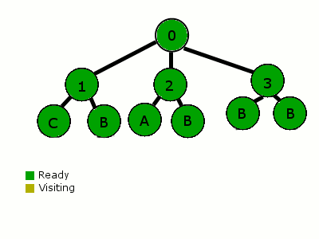

# 1. 行为决策前言

- 机器人行为决策是指机器人在特定环境下通过感知和推理，从众多行为选项中选择出最佳行为策略，并产生相应的动作执行，从而实现自主行动和解决问题的能力。

机器人行为决策系统设计有以下原则：

- 适应性：机器人行为决策系统<u>需要具备适应多变环境和任务需求的能力</u>，需要<u>能够根据环境变化自动调整策略和行为。</u>
- 高效性：行为决策系统**需要具备高效的决策速度**。要在有限的时间内作出最佳的决策，并能够高效地执行决策结果。
- 可靠性：主要体现在该行为决策系统的鲁棒性。
- 透明性：行为决策系统需要具备一定的透明性和可解释性，主要是增强用户对其理解。

# 2. 行为树vs决策树

- 简单来说：

  **决策树**：制定决策

​	   **行为树**：控制行为

​	遍历方式：

​		决策树：每一次都从根到叶子分析；为了让决策树正常工作，每个父节点的子节点都要能表达出父节点所有可能的决策；如果一个节点可以应答“是，否，可能”，那么那必须有三个子节点：“是”节点、“否”节点和“可能”节点。这就意味着，在到达结束节点前，总是可以遍历到某个底层节点。这种遍历总是向下的。



​	行为树：第一次分析（或重置后），它们从根节点开始（这里所有的父节点作为选择器），并且从左到右分析每个子节点。这些子节点按优先级排列。如果一个子节点所有的条件都满足，就开始它的行为。当一个节点开始一个行为，这个节点被设置为“运行中”，并返回这个行为。下一次分析这棵树的时候，重新检查最高优先级的节点，当走到“运行中”节点时，它便知道从它暂停的地方继续执行它。在到达结束状态之前，这个节点可以包含一系列的行动和条件。任意条件失败，遍历器便会返回到父节点。父选择器接着移动到下一个优先级的子节点上。


> 遍历从根节点开始，走到1号子节点，检查子节点的条件（例如“周围是否有滴人？”）。这个条件失败了，遍历器返回树（根节点）并移动到2号节点。2号节点执行了一个行动（例如寻路）和一个行为（例如沿路线走）。“沿路线走”的行为被设置为“运行中”，并且行为树返回状态“运行中”。失败和完成的节点会返回“待命”。接着下一次我们检查这个树，我们再次从最高优先级的节点开始。它又失败了，所以我们执行到2号节点。在2号节点，我们发现有一个“运行中”的行为。当我们发现这个行为完成了，那么我们把它标记成“完成”并返回。然后这颗行为树就被重置了，并准备好再次开始。

- 总结：行为树的运行框架比决策树更加复杂，行为树允许执行更复杂的行为，适合用于更多对行为的控制。考虑到实际目标是令机器人通过自主决策执行不同的行为，更侧重于行为部署，所以选择学习行为树

# 3. Introduction to BTs


# 4. Main Concepts

- 编写行为树，行为树的源码是什么语言？C++ ；还有xml语言，这是干什么的？
- 用户使用c++ 编写 树的节点TreeNode ，在运行时使用XML 格式进行树的实例化

## 4.1 何为TreeNode？

- 任何TreeNode都可以被看作是一种调用回调的机制，即 运行一段代码。这个回调做什么取决于你。

## 4.2 创建具有继承的自定义的节点

- 在上面的示例中，调用的特定类型的treenode `HelloTick` 是使用函数指针（依赖注入）创建的

- 通常，要定义自定义TreeNode，应该继承 类 `TreeNode` ，或者更具体地说，它的派生类
  - `ActionNodeBase`
  - `ConditionNode`
  - `DecoratorNode`

## 4.3 Dataflow，Ports and Blackboard

- Blackboard 是一块储存着 所有 *key/value* 的 位置，这个位置可被树所有的节点所共享
- Ports 是节点之间用来交换信息的一种机制
- Ports 通过 Blackboard 中的相同键 进行连接
- 一个节点的端口数量、名称和类型必须在编译时知道(C)； 端口之间的连接是在部署时完成的（XML）
- 您可以将任何C类型存储为值（我们使用_type擦除技术） 类似于std::any)

# 5. The XML schema

```xml
 <root BTCPP_format="4">
     <BehaviorTree ID="MainTree">
        <Sequence name="root_sequence">
            <SaySomething   name="action_hello" message="Hello"/>
            <OpenGripper    name="open_gripper"/>
            <ApproachObject name="approach_object"/>
            <CloseGripper   name="close_gripper"/>
        </Sequence>
     </BehaviorTree>
 </root>
```

## 5.1 **通过这个简单的例子来说说如何使用xml的语法来构建行为树**

1. 树的第一个标签是` <root> ` 它应该包含一个或多个标签 `<BehaviorTree>`
2. 标签 `<BehaviorTree>` 应该有属性 `[ID]` 
3. 每个TreeNode由single tag表示。特别是:
   - ID: TreeNode 在 factory 中注册需要ID
   - name：实例的名称，可选
   - Ports：通过attribute配置，在这个例子中，需要输入端口 `message`

## 5.2 **在 子节点 数量方面**

- `ControlNodes` contain **1 to N children**.`ControlNodes` 包含1 ~ N个子节点。
- `DecoratorNodes` and Subtrees contain **only 1 child**.`DecoratorNodes` 和Subtrees只包含1个子树。
- `ActionNodes` and `ConditionNodes` have **no child**.`ActionNodes` 和 `ConditionNodes` 没有子节点。

## 5.3 **Ports Remapping 端口重映射 和 Pointers to Blackboards entries 指向黑板条目的指针**

- BB键使用以下语法表示： `{key_name}`

```xml
 <root BTCPP_format="4" >
     <BehaviorTree ID="MainTree">
        <Sequence name="root_sequence">
            <SaySomething message="Hello"/>
            <SaySomething message="{my_message}"/>
        </Sequence>
     </BehaviorTree>
 </root>
```

序列的第一个子序列输出“Hello”，第二个子节点读取和写入blackboard 中的entry中包含的值 叫做“my_message”

## 5.4 **紧凑与显式表示**

- 以下两种语法都是有效的

```xml
 <SaySomething               name="action_hello" message="Hello World"/>
 <Action ID="SaySomething"   name="action_hello" message="Hello World"/>
```

我们称前者为 “compact”语法 ，后者为 “explicit” 语法

即使紧凑语法更方便、更易于编写，但是它提供的关于 TreeNode 的信息过少，像Groot 这个图形化工具 需要添加显式语法或附加信息。可以使用`<TreeNodeModel>`添加此信息

也就是说：为了使用Groot ，你需要这样写：

```xml
 <root BTCPP_format="4" >
     <BehaviorTree ID="MainTree">
        <Sequence name="root_sequence">
           <Action ID="SaySomething"   name="action_hello" message="Hello"/>
           <Action ID="OpenGripper"    name="open_gripper"/>
           <Action ID="ApproachObject" name="approach_object"/>
           <Action ID="CloseGripper"   name="close_gripper"/>
        </Sequence>
     </BehaviorTree>
 </root>
```

或者

```xml
 <root BTCPP_format="4" >
     <BehaviorTree ID="MainTree">
        <Sequence name="root_sequence">
           <SaySomething   name="action_hello" message="Hello"/>
           <OpenGripper    name="open_gripper"/>
           <ApproachObject name="approach_object"/>
           <CloseGripper   name="close_gripper"/>
        </Sequence>
    </BehaviorTree>
    
    <!-- the BT executor don't require this, but Groot does -->     
    <TreeNodeModel>
        <Action ID="SaySomething">
            <input_port name="message" type="std::string" />
        </Action>
        <Action ID="OpenGripper"/>
        <Action ID="ApproachObject"/>
        <Action ID="CloseGripper"/>      
    </TreeNodeModel>
 </root>
```

## 5.5 **子树**

可以使用包含的方式直接 在另一棵树中添加子树，以避免“复制粘贴”同一棵树 多个位置，以减少复杂性

```xml
 <root BTCPP_format="4" >
 
     <BehaviorTree ID="MainTree">
        <Sequence>
           <Action  ID="SaySomething"  message="Hello World"/>
           <SubTree ID="GraspObject"/>
        </Sequence>
     </BehaviorTree>
     
     <BehaviorTree ID="GraspObject">
        <Sequence>
           <Action ID="OpenGripper"/>
           <Action ID="ApproachObject"/>
           <Action ID="CloseGripper"/>
        </Sequence>
     </BehaviorTree>  
 </root>
```

## 5.6 **Include external files** 

可以以类似于C中的“#include \”的方式包含外部文件。 我们可以使用标签轻松地做到这一点：

```xml
  <include path="relative_or_absolute_path_to_file">
```

应用：将5.5 中的例子中的两个行为树拆分为两个文件：

```xml
 <!-- file maintree.xml -->

 <root BTCPP_format="4" >
     
     <include path="grasp.xml"/>
     
     <BehaviorTree ID="MainTree">
        <Sequence>
           <Action  ID="SaySomething"  message="Hello World"/>
           <SubTree ID="GraspObject"/>
        </Sequence>
     </BehaviorTree>
  </root>
```

```xml
 <!-- file grasp.xml -->

 <root BTCPP_format="4" >
     <BehaviorTree ID="GraspObject">
        <Sequence>
           <Action ID="OpenGripper"/>
           <Action ID="ApproachObject"/>
           <Action ID="CloseGripper"/>
        </Sequence>
     </BehaviorTree>  
 </root>
```

# 6. First Behavior Tree


# 7. Blackboard & Port

# 8. Ports with Generic Types


# 9.  Asynchronous Actions 

